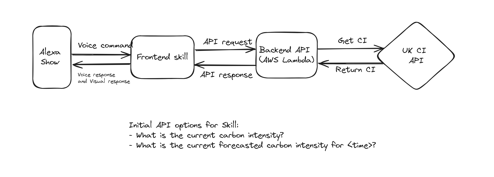

# transmogrifier
An Alexa skill to get and use information about the current carbon intensity using the carbon aware SDK. Enabling "transmogrification" of electricity usage into carbon aware usage - a.k.a. enabling demand shifting. 

# Initial Design - MVP v0.0.1
There are a few options including an SDK with more control over the data we collect or alternatively using already hosted APIs to get the data.
To start with it is one less complexity to use the APIs and this will specifically use the UK's national grid API. This has good documentation, no tiered usage, and the most aligned terms of use.

## Front End
The front end will  be created with the developer skills framework in the console. This can then generate the initial json which will then be stored here and can be updated with an API CI job.

### Invocation:
- "electro transmogrify"

### Intents and utterance mapping:
- Utterance: "What is the current carbon intensity" -> GetCurrentCarbonIntensity

Note: There will be no slots for this. They may be used for the forecast extension to give a specific time. Future considerations: a dialog model.

## Back End
This is where the requests from alexa will come in and be handled. These will be API routes based on the different intents. They will then get the relevant information from the CI APIs, transform it to visual/words in a request response, and send this back to Alexa.

## Links:
- https://carbon-aware-sdk.greensoftware.foundation/docs/tutorial-basics/carbon-aware-webapi
- https://carbon-intensity.github.io/api-definitions/#carbon-intensity-api-v2-0-0
- Alternative APIs: https://developers.thegreenwebfoundation.org/grid-intensity-cli/explainer/providers/
- https://developer.amazon.com/en-US/docs/alexa/custom-skills/steps-to-build-a-custom-skill.html

# Build, deploy, and connect the backend
https://docs.aws.amazon.com/lambda/latest/dg/golang-package.html

1. Set up aws lambda function in correct region with selected name, and the os only runtime
2. Create a go binary for a lambda function using `GOOS=linux GOARCH=amd64 go build -tags lambda.norpc -o bootstrap main.go` (Note: it must be called bootstrap)
3. Zip the relevant code and binary for upload to lambda `zip transmogrification.zip bootstrap`
4. Upload to lambda using a zip file
5. Add a trigger for the lambda function using the alexa skill ID 
6. Connect to the alexa skill by copying the ARN and navigating to the endpoint of the alexa skill and pasting the ARN. Note: you can use ARN for specific version or create an alias arn for different versions as development occurs.

# Improvements
- logging and error handling
- metrics
- tests
- errors 
- build out a visual response creator as well as the simple speech
- Versioning and ctx trace tokens in logs and connected to traces.